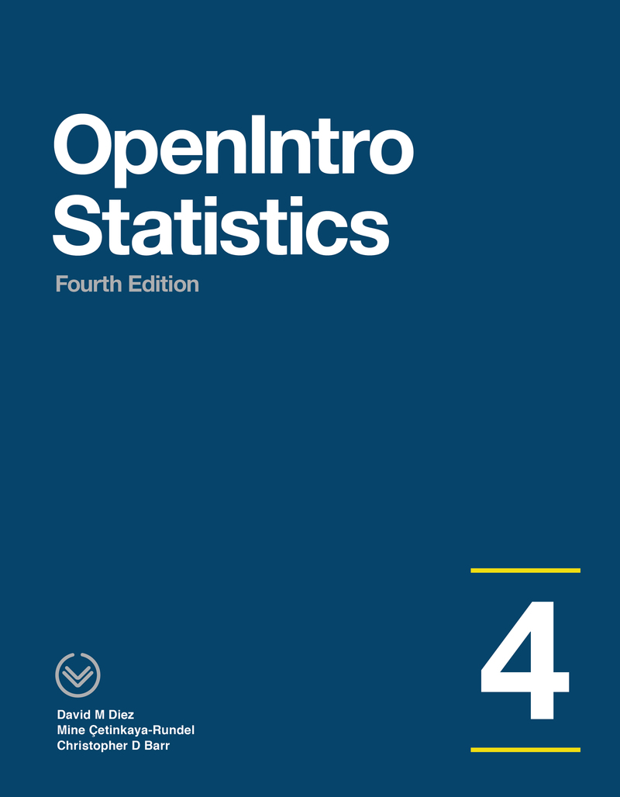
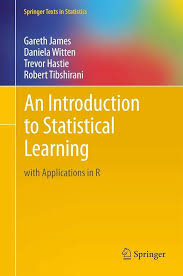
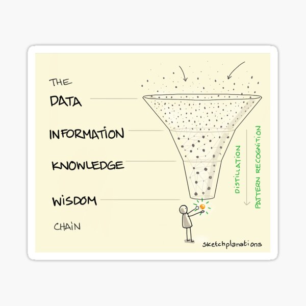
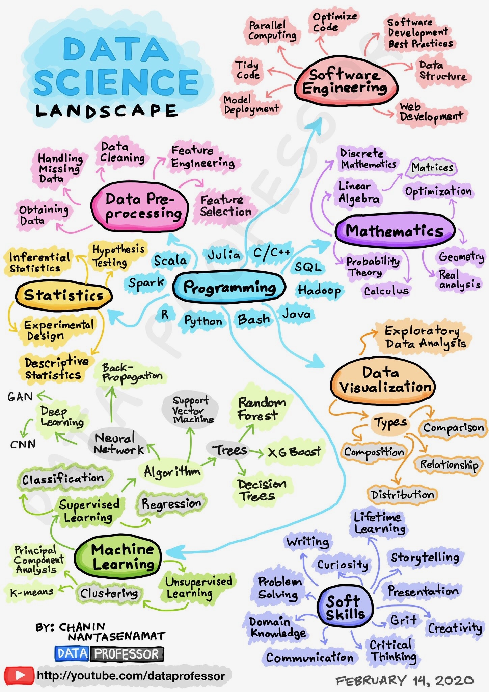
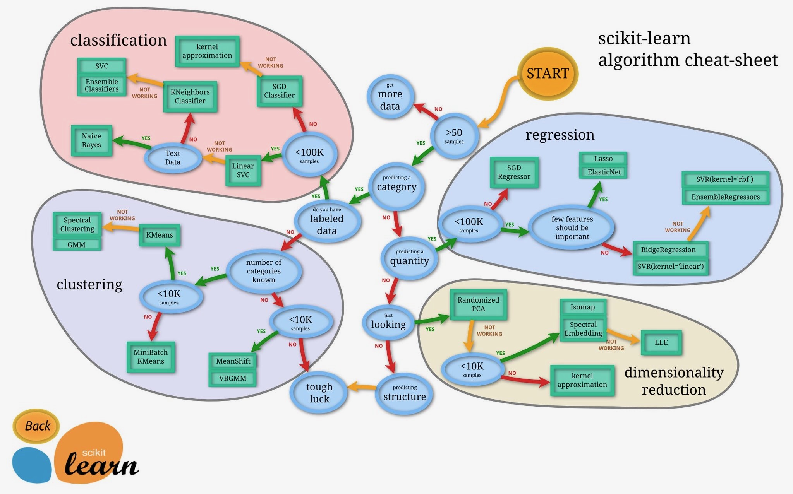

```{r setup, include = FALSE}
# Cartoons from https://github.com/allisonhorst/stats-illustrations
# dplyr based upon https://allisonhorst.shinyapps.io/dplyr-learnr/#section-welcome

source('../config.R')
```

class: center, middle, inverse, title-slide

# `r metadata$title`
## `r metadata$subtitle`
### `r metadata$author`
### `r metadata$date`


---
# Agenda

* Syllabus
* Class meetups
* Course Schedule
* Assignments (how you will be graded)
	* Participation
	* Labs
	* Data Project
	* Exams
* Introduction to predictive modeling

---

# Syllabus `r hexes(c('blogdown', 'rmarkdown'))`

Syllabus and course materials are here: [https://`r paste0(tolower(semester), year)`.is382.net](https://`r paste0(tolower(semester), year)`.is382.net)

The site is built using [Quarto](https://quarto.org) and hosted on [Github](https://github.com/jbryer/`r github_repo`). Each page of the site has a "Edit this page" link at the bottom right, use that to start a pull request on Github.

We will use Brightspace primary for submitting assignments only. Please submit a PDF.

PDFs are preferred for the homework as there is some LaTeX formatting in the R markdown files. The `tineytex` R package helps with install LaTeX, but you can also install LaTeX using [MiKTeX](http://miktex.org) (for Windows) and [BasicTeX](http://www.tug.org/mactex/morepackages.html) (for Mac) See this page for more information: 
https://`r paste0(tolower(semester), year)`.is382.net/course-overview/software/

---
class: font90

# Meetups

We will have meetups on `r class_day` evenings from `r class_time`. 

Meetups will be recorded and made available the next day on the [course website](https://`r paste0(tolower(semester), year)`.is382.net).

Though attending live is not strictly required, **I expect everyone to watch the lectures during the week.** I use the class meetups to convey important information and announcements. Very often I will cover some topics not in the textbook. Students who attend the meetups tend to do well on the assignments.

**One Minute Papers** - Complete the one minute paper after each Meetup (whether you watch live or watch the recordings). It should take approximately one to two minutes to complete. This allows me to 1) verify you have attended/watch the meetup and 2) get feedback about what you learned and what you may still be unclear.

.font60[

**Please note:** *Students who participate in this class with their camera on or use a profile image are agreeing to have their video or image recorded solely for the purpose of creating a record for students enrolled in the class to refer to, including those enrolled students who are unable to attend live. If you are unwilling to consent to have your profile or video image recorded, be sure to keep your camera off and do not use a profile image. Likewise, students who un-mute during class and participate orally are agreeing to have their voices recorded. If you are not willing to consent to have your voice recorded during class, you will need to keep your mute button activated and communicate exclusively using the "chat" feature, which allows students to type questions and comments live.* [Click here for CUNY's camera use policy](https://www.cuny.edu/wp-content/uploads/sites/4/page-assets/academics/faculty-affairs/Camera-Use-Guidance-for-Online-and-Hybrid-Courses_FINAL-JUNE-20-2024.pdf)

]

---
class: font70
# Schedule

```{r schedule-setup, echo=FALSE, warning=FALSE, message=FALSE}
# devtools::install_github("gadenbuie/ggweekly")
library(ggweekly)
library(rlang) # Needed for the ggweekly.R script to work
library(configr)
library(ggplot2)
library(readxl)
library(lubridate)
# library(kableExtra)

options(knitr.kable.NA = '')

palette <- c('#8dd3c7','#ffffb3','#bebada','#fb8072','#80b1d3','#fdb462',
			 '#b3de69','#fccde5','#d9d9d9','#bc80bd','#ccebc5','#ffed6f')

lastModified <- format(file.info('../Schedule.xlsx')[1,]$mtime, '%B %d, %Y %I:%M%p')

options(knitr.kable.NA = '')
readxl::read_excel('../Schedule.xlsx') |>
	dplyr::select(Week, Topic) |>
	knitr::kable(row.names = FALSE, align = c('l','l')) |>	
	kableExtra::column_spec(column = 1, width_max = '20px') 

```

---

# Textbooks `r hexes(c('openintro'))`

.pull-left[

Diez, D.M., Barr, C.D., & Çetinkaya-Rundel, M. (2019). *OpenIntro Statistics (4th Ed)*.

.font70[

]

.center[

<a href = "https://github.com/jbryer/DATA606spring2024/blob/master/Resources/Textbooks/os4.pdf"></a>

]

]

.pull-right[

James, G., Witten, D., Hastie, T., & Tibshirani, R. (2021). *An Introduction to Statistical Learning with Applications in R (2nd Ed)*.

.font70[

]

.center[

<a href = "https://fall2026.is382.net/resources/ISLR2.pdf"></a>

]

]

---

# Assignments

* **Weekly labs** (50%). They are available on the course schedule page: [`r paste0(tolower(semester), year)`.is382.net/schedule.html](https://`r paste0(tolower(semester), year)`.is382.net/schedule.html)

* **[Data Project](https://fall2026.is382.net/project.html)** (25%). We will cover this more as the semester progresses, but is similar to what you did for IS381.

* **Final Exam** (15%). This will be completed on Brightspace during the last week of the semester.

* **Participation** (10%). Attending/watching the weekly meetups and completing the one minute papers.


---

# Communication

* Slack Channel: `r slack_link`
	* [Click here to join the group](`r slack_invite_link`)

* Email: [jason.bryer@cuny.edu](mailto:jason.bryer@cuny.edu)

* Phone/Zoom: Please email to schedule a time to meet.

* Office hours by appointment.

---

# Software `r hexes(c('rmarkdown', 'RStudio', 'tinytex'))`

This is an applied statistics course so we will make extensive use of the [R statistical programming language](https://www.r-project.org).

Install [R](https://cran.r-project.org) and [RStudio](https://rstudio.com) on your own computer. I encourage everyone to do this at some point by the end of the semester. I have instructions on the course website here: https://`r paste0(tolower(semester), year)`.is382.net/course-overview/software/

You will also need to have [LaTeX](https://www.latex-project.org) installed as well in order to create PDFs. The [`tinytex`](https://yihui.org/tinytex/) R package helps with this process:

```
install.packages('tinytex')
tinytex::install_tinytex()
```

---
class: inverse, middle, center
# Introduction to Predictive Modeling

---
class: font90, middle
# Learning...

.pull-left[
<br/><br/>

> Where is the Life we have lost in living?  
> Where is the wisdom we have lost in knowledge?  
> Where is the knowledge we have lost in information?

*Excerpt from [The Rock](https://leavesandpages.com/2013/01/03/poetry-excerpts-from-the-rock-by-t-s-eliot/) by T.S. Eliot*
]
.pull-right[
```{r, echo=FALSE}

```
]
---
# Data Science Landscape

```{r, echo=FALSE, out.width='35%'}

```


---
# Types of machine learning algorithms

```{r, echo=FALSE, out.width='80%'}

```

---
# Supervised vs. Unsupervised Learning

.pull-left[
**Supervised Learning**

* Starting point: 
	* Outcome measurement Y (also called dependent variable, response, target).
	* Vector of p predictor measurements X (also called inputs, regressors, covariates, features, independent variables).
	* We have training data we can use to estimate the model.
* Objectives: 
	* Accurately predict unseen test cases.
	* Understand which inputs affect the outcome, and how.
	* Assess the quality of our predictions and inferences.

]
.pull-right[
**Unsupervised Learning**

* No outcome variable, just a set of predictors (features) measured on a set of samples.
* Objective is more fuzzy — find groups of samples that behave similarly, find features that behave similarly, find linear combinations of features with the most variation.
* Difficult to know how well your are doing.
* different from supervised learning, but can be useful as a pre-processing step for supervised learning.
]

---
# Statistical Learning vs. Machine Learning

* Machine learning arose as a subfield of Artificial Intelligence.

* Statistical learning arose as a subfield of Statistics.

* There is much overlap — both fields focus on supervised and unsupervised problems:

* Machine learning has a greater emphasis on large scale applications and prediction accuracy.

* Statistical learning emphasizes models and their interpretability, and precision and uncertainty.

* But the distinction has become more and more blurred, and there is a great deal of “cross-fertilization”.

* Machine learning has the upper hand in Marketing!

---
# Example of a machine learning problem

```{r, warning = FALSE}
data(legosets, package = 'brickset')
legosets <- legosets |> dplyr::filter(year > 2010)
ggplot(legosets, aes(y = US_retailPrice, x = pieces, color = minifigs)) +
	geom_point() + geom_smooth(se = FALSE)
```

---
# An example from my own work `r hexes(c('DAACS'))`

The Diagnostic Assessment and Achievement of College Skills (DAACS) is a suite of assessments designed to assess college readiness including:

* A Self-Regulated Learning Assessment with approximately 60 items
	* Using exploratory factor analysis, we combine the items to create four subdomains (i.e. motivaiton, metacognition, strategies, self-efficacy)
* Math and reading assessment (students complete 18 to 24 items and receive a total score ranging from 0 to 1)
* Writing assessment (this is machine scored using large language models and predictive models)
* Feedback views (this is a measure of how many pages students view)

We also have basic demographic data.

Our outcome measure of interest is academic success (e.g. GPA, retention, graduation).

.font80[
See Bryer, J.M., Akhmedjanova, D., Andrade, H.L., & Lui, A.M. (2021). [The use of predictive modeling for assessing college readiness](https://www.emerald.com/books/edited-volume/18592/chapter-abstract/102195056/The-Use-of-Predictive-Modeling-for-Assessing?redirectedFrom=PDF). In H. Jiao & R.W. Lissitz (Eds.) *Enhancing Effective Instruction and Learning Using Assessment Data,* Emerald Insight. https://doi.org/10.1108/978-1-64802-628-7
]

---
# Next steps... `r hexes(c('DAACS'))`

As soon as possible:

* [Join the Slack channel](`r slack_invite_link`)

Then:

* Start the *Introduction to the Modeling* lab (due September 6th)

---
class: inverse, right, middle, hide-logo


# Good luck with the semester!

[`r icons::fontawesome("paper-plane")` jason.bryer@cuny.edu](mailto:jason.bryer@cuny.edu)  
[`r icons::fontawesome("slack")` `r gsub('https://', '', slack_link)`](`r slack_link`)  
[`r icons::fontawesome("github")` @jbryer](https://github.com/jbryer)  
[`r icons::fontawesome('mastodon')` @jbryer@vis.social](https://vis.social/@jbryer)  
[`r icons::fontawesome("link")` `r paste0(tolower(semester), year, '.data606.net')`](https://`r paste0(tolower(semester), year, '.data606.net')`)   


